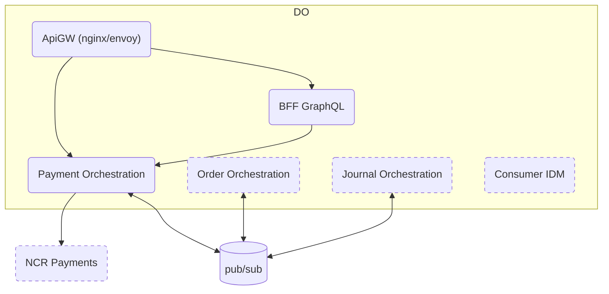

# Payment Orchestration High Level Design

## Design

```mermaid
flowchart TB
    subgraph DO
        apigw("ApiGW (nginx/envoy) ")
        bff(BFF GraphQL)
        paymentapi(Payment Orchestration)
        orderapi(Order Orchestration)
        journalapi(Journal Orchestration)
        idm(Consumer IDM)
        apigw-->bff
        apigw-->paymentapi
        bff-->paymentapi
    
    end

    paymentgw("NCR Payments")
    
    pubsub[("pub/sub")]
    
    paymentapi-->paymentgw
    paymentapi <--> pubsub
    orderapi <--> pubsub
    journalapi <--> pubsub
    
    style journalapi stroke-dasharray: 5 5
    style orderapi stroke-dasharray: 5 5
    style paymentgw stroke-dasharray: 5 5
    style idm stroke-dasharray: 5 5
    style pubsub rotate: 90
```
